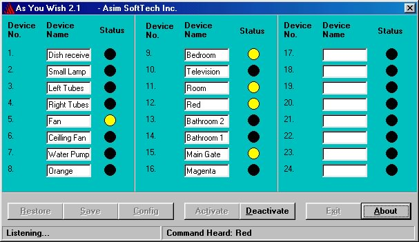



## As You Wish 2\.1   \- Asim Abbasi

### Description

Purpose

The purpose of creating this project is to control all home equipments e.g. Fans, Lights, Door motor, Electric Heater, TV, VCR, Water Pump etc through Voice. The user will no longer have to move from his seat, just to turn on the Fan. He will just call the Fan with its Name, rest will be done by "As You Wish".

Project Details

This project has two parts one is related to Software and other related to Hardware. Normally you have to plug the hardware to your system after that you have to install the software. First of all, connect the Microphone to the sound card and check whether it is working or not by using the Sound Recorder Utility in Windows.

You have to plug the Hardware to the any Parallel Port of you PC. There are 24 sockets available on the Hardware, in which the devices to be controlled will be plugged in. There is also a AC supply Plug which you have to plug in the 220v~ supply. Now the Hardware setup is completed. After the completion of hardware setup, start your computer and run the As You Wish software (its is assumed that the software has been previously installed). Now you can create the menu of devices names. The Device Numbers on the software and Hardware are the same. Click Save when all the names have been entered.

Click Config button to set the configuration of the software. Write the address of Parallel Port on which you have connected the hardware. You can also train the Voice Engine with your voice by clicking Train. Click Ok. Click Activate. Wait for the Listening status to appear. Now its ready to obey your previously entered commands.

Disclaimer:

Download &amp; use this software at your own risk. If something wrong happens to your system or anyone else system connected to your computer, neither Takveen nor the author would not be responsible!!!
 
### More Info
 

             |
---                |---
**Submitted On**   |2002-03-02 00:32:48
**By**             |[Asim Abbasi](https://github.com/Planet-Source-Code/PSCIndex/blob/master/ByAuthor/asim-abbasi.md)
**Level**          |Advanced
**User Rating**    |4.4 (31 globes from 7 users)
**Compatibility**  |VB 5\.0, VB 6\.0
**Category**       |[Complete Applications](https://github.com/Planet-Source-Code/PSCIndex/blob/master/ByCategory/complete-applications__1-27.md)
**World**          |[Visual Basic](https://github.com/Planet-Source-Code/PSCIndex/blob/master/ByWorld/visual-basic.md)
**Archive File**   |[As\_You\_Wis2010007312006\.zip](https://github.com/Planet-Source-Code/asim-abbasi-as-you-wish-2-1-asim-abbasi__1-66140/archive/master.zip)

